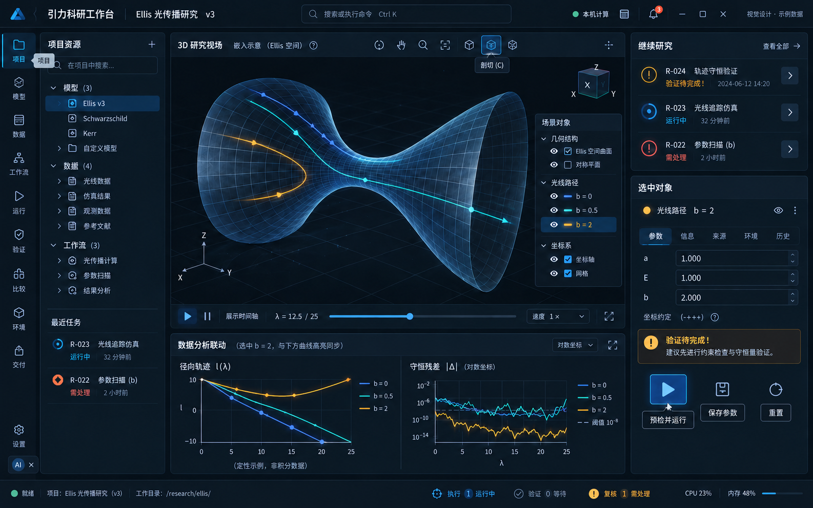
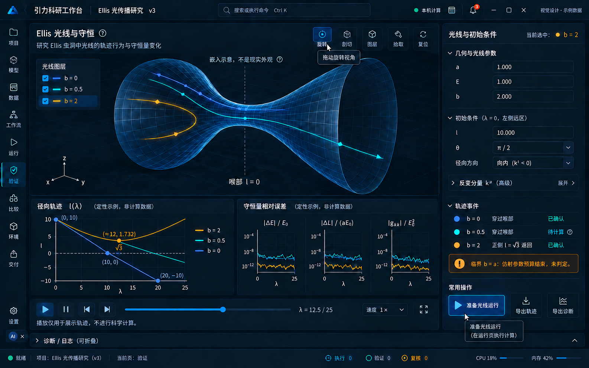

# 界面设计稿与开发索引

本目录保存已生成的设计原图与规范，克隆仓库后即可浏览。`v3/`是用户确认的科技版唯一视觉基准；`archive/legacy/`是旧版内容参考。表中的“已有”仅表示设计图片存在，不代表页面功能已经实现或验收通过。

## 基准与材料状态

- **v3：34张界面PNG、1份[全局设计规范JSON](v3/全局设计规范.json)。** 现有原图与生成记录按原字节归档。
- **旧版：49张界面PNG、2份生成记录。** 旧版UI-15、UI-16文件名中的`v3`仅是旧稿的局部修订号，不属于当前科技版基准。
- **v3仍缺15页：UI-12—14、UI-32—36、UI-43—49。** 下表提供对应旧稿便于核对功能内容，不能将旧稿标记为v3已完成，也不能因此删去PRD范围。
- 原始全局规范的`scope`描述计划目标“49张完整功能界面、1张视觉规范、6张交互分镜”；本次实际材料中未找到单独的视觉规范图片或6张交互分镜。该字段不代表交付已齐全。
- 已提供的是PNG位图及下列JSON记录，没有可交付的Figma等分层源文件。补稿、实现和验收需分别留存依据。

预览科技版研究总览与Ellis守恒分析

## 全部49页

| 编号 | 功能页面 | v3设计稿 | 旧版内容参考 |
| --- | --- | --- | --- |
| UI-01 | 三维研究总览 | [已有](v3/UI-01-三维研究总览.png) | [项目首页](archive/legacy/UI-01-项目首页.png) |
| UI-02 | 项目选择与新建 | [已有](v3/UI-02-项目选择与新建.png) | [旧稿](archive/legacy/UI-02-项目选择与新建.png) |
| UI-03 | 模型与文献 | [已有](v3/UI-03-模型与文献.png) | [旧稿](archive/legacy/UI-03-模型与文献.png) |
| UI-04 | 脚本与命令编辑器 | [已有](v3/UI-04-脚本与命令编辑器.png) | [旧稿](archive/legacy/UI-04-脚本与命令编辑器.png) |
| UI-05 | 笔记本 | [已有](v3/UI-05-笔记本.png) | [旧稿](archive/legacy/UI-05-笔记本.png) |
| UI-06 | 数据目录与详情 | [已有](v3/UI-06-数据目录与详情.png) | [旧稿](archive/legacy/UI-06-数据目录与详情.png) |
| UI-07 | 数据导入 | [已有](v3/UI-07-数据导入.png) | [旧稿](archive/legacy/UI-07-数据导入.png) |
| UI-08 | 数据筛选与转换 | [已有](v3/UI-08-数据筛选与转换.png) | [旧稿](archive/legacy/UI-08-数据筛选与转换.png) |
| UI-09 | 工作流画布 | [已有](v3/UI-09-工作流画布.png) | [旧稿](archive/legacy/UI-09-工作流画布.png) |
| UI-10 | 参数扫描 | [已有](v3/UI-10-参数扫描.png) | [旧稿](archive/legacy/UI-10-参数扫描.png) |
| UI-11 | 运行预检可提交 | [已有](v3/UI-11-运行预检可提交.png) | [旧稿](archive/legacy/UI-11-运行预检可提交.png) |
| UI-12 | 运行预检阻断 | 待补科技版 | [旧稿](archive/legacy/UI-12-运行预检阻断.png) |
| UI-13 | 运行总览 | 待补科技版 | [旧稿](archive/legacy/UI-13-运行总览.png) |
| UI-14 | 运行详情与取消 | 待补科技版 | [旧稿](archive/legacy/UI-14-运行详情与取消.png) |
| UI-15 | 远程提交核实 | [已有](v3/UI-15-远程提交核实.png) | [旧稿局部修订](archive/legacy/UI-15-远程提交待核实-v3.png) |
| UI-16 | 失败重试与检查点 | [已有](v3/UI-16-失败重试与检查点.png) | [旧稿局部修订](archive/legacy/UI-16-失败重试与检查点恢复-v3.png) |
| UI-17 | 验证诊断可视化 | [已有](v3/UI-17-验证诊断可视化.png) | [结果与数值验证](archive/legacy/UI-17-结果与数值验证-v2.png) |
| UI-18 | 图表与三维展示编辑 | [已有](v3/UI-18-图表与三维展示编辑.png) | [科研图表编辑与导出](archive/legacy/UI-18-科研图表编辑与导出-v2.png) |
| UI-19 | 模型对照与敏感性 | [已有](v3/UI-19-模型对照与敏感性.png) | [多运行与多模型比较](archive/legacy/UI-19-多运行与多模型比较-v2.png) |
| UI-20 | 版本分支与复核 | [已有](v3/UI-20-版本分支与复核.png) | [版本复核与冲突合并](archive/legacy/UI-20-版本复核与冲突合并-v2.png) |
| UI-21 | 研究包导出预检 | [已有](v3/UI-21-研究包导出预检.png) | [研究包导出与许可预检](archive/legacy/UI-21-研究包导出与许可预检.png) |
| UI-22 | 隔离导入与冲突 | [已有](v3/UI-22-隔离导入与冲突.png) | [研究包隔离导入](archive/legacy/UI-22-研究包隔离导入-v2.png) |
| UI-23 | 跨环境复现计划 | [已有](v3/UI-23-跨环境复现计划.png) | [跨环境复现](archive/legacy/UI-23-跨环境复现-v2.png) |
| UI-24 | 项目维护与安全退出 | [已有](v3/UI-24-项目维护与安全退出.png) | [项目备份归档与删除](archive/legacy/UI-24-项目备份归档与删除.png) |
| UI-25 | 助手上下文与授权 | [已有](v3/UI-25-助手上下文与授权.png) | [旧稿](archive/legacy/UI-25-助手上下文与授权.png) |
| UI-26 | 助手代码差异审阅 | [已有](v3/UI-26-助手代码差异审阅.png) | [旧稿](archive/legacy/UI-26-助手代码差异审阅.png) |
| UI-27 | 助手解释与证据 | [已有](v3/UI-27-助手解释与证据.png) | [旧稿](archive/legacy/UI-27-助手解释与证据.png) |
| UI-28 | 环境中心 | [已有](v3/UI-28-环境中心.png) | [旧稿](archive/legacy/UI-28-环境中心.png) |
| UI-29 | 离线环境创建 | [已有](v3/UI-29-离线环境创建.png) | [旧稿](archive/legacy/UI-29-离线环境创建.png) |
| UI-30 | 适配器与模板 | [已有](v3/UI-30-适配器与模板.png) | [旧稿](archive/legacy/UI-30-适配器与模板.png) |
| UI-31 | 远程资源与凭据 | [已有](v3/UI-31-远程资源与凭据.png) | [旧稿](archive/legacy/UI-31-远程资源与凭据.png) |
| UI-32 | 权限与资源预算 | 待补科技版 | [旧稿](archive/legacy/UI-32-权限与资源预算.png) |
| UI-33 | 存储维护与迁移 | 待补科技版 | [旧稿](archive/legacy/UI-33-存储维护与迁移.png) |
| UI-34 | 应用更新与回滚 | 待补科技版 | [旧稿](archive/legacy/UI-34-应用更新与回滚.png) |
| UI-35 | 诊断与异常恢复 | 待补科技版 | [旧稿](archive/legacy/UI-35-诊断与异常恢复.png) |
| UI-36 | 设置与本机能力 | 待补科技版 | [旧稿](archive/legacy/UI-36-设置与本机能力.png) |
| UI-37 | 模型与符号推导 | [已有](v3/UI-37-模型与符号推导.png) | [旧稿](archive/legacy/UI-37-模型与符号推导.png) |
| UI-38 | ODE初值与事件 | [已有](v3/UI-38-ODE初值与事件.png) | [旧稿](archive/legacy/UI-38-ODE初值与事件.png) |
| UI-39 | BVP边值与分支 | [已有](v3/UI-39-BVP边值与分支.png) | [旧稿](archive/legacy/UI-39-BVP边值与分支.png) |
| UI-40 | 谱与稳定性扫描 | [已有](v3/UI-40-谱与稳定性扫描.png) | [旧稿](archive/legacy/UI-40-谱与稳定性扫描.png) |
| UI-41 | 已有PDE执行 | [已有](v3/UI-41-已有PDE执行.png) | [旧稿](archive/legacy/UI-41-已有PDE执行.png) |
| UI-42 | Ellis光线与守恒 | [已有](v3/UI-42-Ellis光线与守恒.png) | [旧稿](archive/legacy/UI-42-Ellis光线与守恒.png) |
| UI-43 | 相机光源与图像桥接 | 待补科技版 | [旧稿](archive/legacy/UI-43-相机光源与图像桥接.png) |
| UI-44 | VLBI合成观测 | 待补科技版 | [旧稿](archive/legacy/UI-44-VLBI合成观测.png) |
| UI-45 | VLBI重建 | 待补科技版 | [旧稿](archive/legacy/UI-45-VLBI重建.png) |
| UI-46 | 数据、似然与先验 | 待补科技版 | [旧稿](archive/legacy/UI-46-数据似然与先验.png) |
| UI-47 | emcee后验诊断恢复 | 待补科技版 | [旧稿](archive/legacy/UI-47-emcee后验诊断恢复.png) |
| UI-48 | XSPEC模拟与拟合 | 待补科技版 | [旧稿](archive/legacy/UI-48-XSPEC模拟与拟合.png) |
| UI-49 | 科学引擎已有安装 | 待补科技版 | [旧稿](archive/legacy/UI-49-科学引擎已有安装.png) |

## 接续实现时使用的依据

功能与验收以[PRD](../PRD.md)为准；数据路径见[架构](../ARCHITECTURE.md)。主题令牌集中在[system.ts](../src/design/system.ts)，Ant Design主题在[theme.ts](../src/design/theme.ts)，全局布局在[src/styles](../src/styles/)，真实三维与分析图在[src/visualization](../src/visualization/)。新增页面应复用这些实现，避免各自复制一套色板或交互状态。

设计图中的数值、时间、资源使用率和运行状态均是示意。执行、科学验证、人工复核必须分别记录，缺失证据不能显示成通过。用户已经确认默认保持真实几何比例；相机、视口及统一显示尺度可调整构图，不能拉伸Ellis曲面去复制示意外形。

图片不代替完整交互定义：保留图标的可访问名称、键盘焦点、错误恢复和减少动态效果支持。提示优先使用感叹号图标；单位、来源、授权和不可逆操作保留必要文字。原始规范中的动效时长为设计目标，不是已测得的性能指标。

## 原始生成记录

- [旧版通用界面生成记录](archive/legacy/提示词-通用界面.json)
- [旧版助手与系统生成记录](archive/legacy/提示词-助手与系统.json)

记录内的绝对路径是当时的生成来源，按原样保留作历史信息，不是克隆仓库后的运行或开发依赖；个别`reference_at_generation`指向当时旧修订稿。当前归档原图及其入口以以上索引和本目录实际文件为准，不能依赖生成机器的`C:`盘或`.codex/generated_images`目录。当前材料中未找到科技版的完整独立提示词记录。
